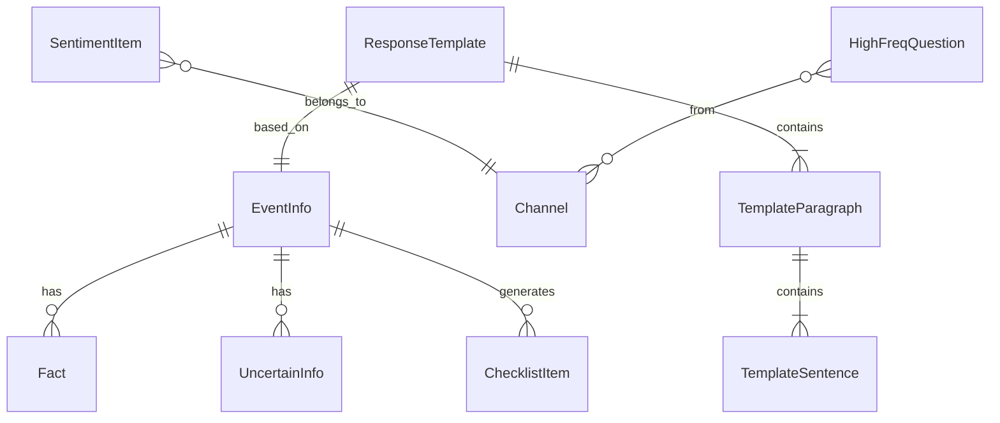

## 1. 架构设计

```mermaid
flowchart TD
    "前端 React SPA" --> "状态管理 Zustand"
    "状态管理 Zustand" --> "本地存储 LocalStorage"
    "前端 React SPA" --> "模拟数据层 MockData"
    "模拟数据层 MockData" --> "舆情模拟数据"
    "模拟数据层 MockData" --> "处置清单模板"
    "模拟数据层 MockData" --> "回应草稿模板"
```

本系统为纯前端应用，不依赖后端服务。所有数据通过 Zustand 状态管理存储在内存中，关键数据持久化至 LocalStorage，模拟数据层提供舆情信息和模板数据。

## 2. 技术说明

- 前端框架：React@18 + TypeScript
- 样式方案：Tailwind CSS@3
- 构建工具：Vite
- 状态管理：Zustand（轻量级，适合单页应用）
- 图标库：Lucide React
- 数据可视化：Recharts（饼图、词云等）
- 文档导出：html-docx-js（导出Word）
- 初始化工具：Vite

## 3. 路由定义

| 路由 | 用途 |
|------|------|
| / | 重定向至事件录入页 |
| /event-entry | 事件录入页，填写事件基本信息、已确认事实、暂不确定信息，生成处置清单 |
| /sentiment-scan | 舆情快扫页，按渠道分类展示舆情，高频质疑看板 |
| /response-draft | 回应草稿页，三段式模板编辑，导出审签 |

## 4. API 定义

本系统无后端，所有数据通过模拟数据层和本地状态管理实现。

### 4.1 模拟数据接口

```typescript
interface EventInfo {
  id: string
  name: string
  location: string
  time: string
  involvedUnits: string[]
  eventType: string
  casualtyLevel: string
  confirmedFacts: Fact[]
  uncertainInfo: UncertainInfo[]
  checklist: ChecklistItem[]
}

interface Fact {
  id: string
  content: string
  source: string
  confirmedAt: string
}

interface UncertainInfo {
  id: string
  content: string
  status: '待核实' | '核实中' | '已排除'
  urgency: '高' | '中' | '低'
}

interface ChecklistItem {
  id: string
  content: string
  priority: '紧急' | '重要' | '一般'
  type: '事实补齐' | '联系单位' | '核实传言'
  completed: boolean
}

interface SentimentItem {
  id: string
  channel: '媒体报道' | '短视频评论' | '社区论坛' | '投诉热线'
  title: string
  summary: string
  emotionLevel: 1 | 2 | 3 | 4 | 5
  tendency?: '客观' | '质疑' | '煽动'
  heat: number
  timestamp: string
}

interface HighFreqQuestion {
  id: string
  content: string
  frequency: number
  emotionLevel: 1 | 2 | 3 | 4 | 5
  channels: string[]
}

interface ResponseTemplate {
  factStatement: TemplateParagraph
  soothingExpression: TemplateParagraph
  followUpMeasures: TemplateParagraph
}

interface TemplateParagraph {
  sentences: TemplateSentence[]
}

interface TemplateSentence {
  id: string
  content: string
  selected: boolean
  edited: boolean
  originalContent: string
}
```

## 5. 服务端架构图

不适用（纯前端应用）

## 6. 数据模型

### 6.1 数据模型定义



### 6.2 数据定义语言

本系统使用 LocalStorage 存储，数据结构以 JSON 格式持久化：

- `emergency_event`：当前事件信息（EventInfo）
- `emergency_sentiments`：舆情数据列表（SentimentItem[]）
- `emergency_questions`：高频质疑列表（HighFreqQuestion[]）
- `emergency_response`：回应草稿（ResponseTemplate）
